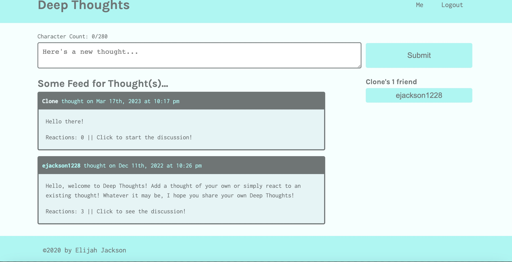

 [] 
# <h1 align="center">Deep-Thoughts</h1>

<a href="https://deep-thoughts.herokuapp.com/">Visit the app here!</a>

## Description
A thought sharing blog featuring user signup/login, profiles, posts, reactions, comments, and friends. 
  
## Table of Contents
  - [Description](#description)
  - [Usage](#usage)
  - [License](#license)
  - [Contributors](#contributors)
  - [Questions](#questions)

## Usage
Log onto the live website, create a user login, and share whatever creative, insightful, or random thoughts you may have! :)

## License
[]This application is covered under the MIT license. (https://opensource.org/licenses/MIT)

## Technologies
- React (https://react.dev/)
- GraphQL (https://graphql.org/)
- MongoDB (https://www.mongodb.com/)
- Mongoose (https://mongoosejs.com/)
- Apollo (https://www.apollographql.com/)
- ExpressJS (https://expressjs.com/)

## Questions? Contact me:
GitHub: https://github.com/ejackson1228/  
Email: ejackson1228@gmail.com